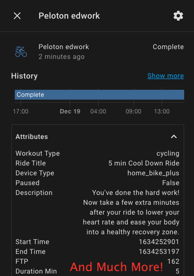

# HomeAssistant Peloton Sensor

### Overview
HomeAssistant Peloton Sensor is an integration that exposes either your latest ride's stats or your current ride's stats as a sensor. This can be useful to turn off lights, turn on fans, set scenes, etc. 
- Sensor state shows either Complete or In Progress
- State Attributes include:
  - Duration
  - Leaderboard Rank
  - Output
  - Distance
  - Calories
  - Heart Rate (Current, Average, Max)
  - Resistance (Current, Average, Max)
  - Speed Mph/Kph (Current, Average, Max)
  - Cadence (Current, Average, Max)
  - Power (Current, Average, Max)
  - Instructor
  


### Under the Hood
This integration uses [Pylotoncycle](https://pypi.org/project/pylotoncycle/) to poll Peloton's API every minute. Keep in mind that polling won't be instant when creating Automations. 

### Custom Component Installation
Download this repository and place the `custom_components/peloton/` directory within a folder called `custom_components/` in the root of your HomeAssistant Configuration directory.

### configuration.yaml
Your Configuration should look a little something like this:

```
sensor:
  - platform: peloton
    username: thedude
    password: paSSw0rdz
  - platform: peloton
    username: thedudette
    password: paSSw0rdz
```

This will give you a sensor named `sensor.peloton_USERNAME` - allowing for multiple instances!

### Additional Sensors via Templating
Sometimes it's easier to work with the state directly, which will retain state history via the recorder. 
```
sensor:
  - platform: template
    sensors:
    power_output:
      friendly_name: "Power Output"
      value_template: >
        {{ state_attr('sensor.peloton_username', "Workout Type" ) }}
```

## Use Cases
- Automate lights and fans when you start or end a workout, or when your output exceeds a certain threshold. 
- Motovation - make HomeAssistant remind you to workout!
- Export your ride stats to InfluxDB via HomeAssistant

### ToDo
* Configuration within the HA Web Interface (required for official HASS integration)
* Error Handling of unsuccessful login
* Error Handling of an unexpected API Change
* MegaTemplate for people who wish to expose more attributes as sensors

### Final Thoughts
Pull requests and issues are very welcome! At the moment the integration works but should be considered as beta. 
